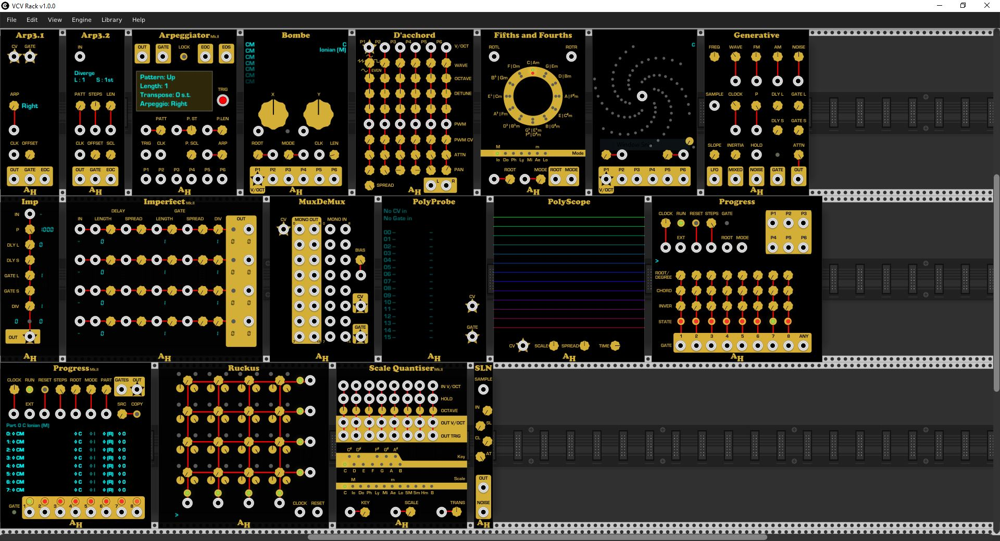

Welcome to the Amalgamated Harmonics.

* [Scale Quantizer](https://github.com/jhoar/AmalgamatedHarmonics/wiki/Scale-Quantizer), a scale-aware quantizer with multiple input and outputs.
* [Arpeggiator](https://github.com/jhoar/AmalgamatedHarmonics/wiki/Arpeggiator), a multi-input arpeggiator.
* [Progress](https://github.com/jhoar/AmalgamatedHarmonics/wiki/Progress), a chord sequencer.
* [Fifths and Fourths](https://github.com/jhoar/AmalgamatedHarmonics/wiki/54), an implementation of the Circle of Fifths intended to work with Progress, Scale Quantizer and Galaxy.
* [Imperfect](https://github.com/jhoar/AmalgamatedHarmonics/wiki/Imperfect), a trigger-to-gate and clock divider module.
* [Ruckus](https://github.com/jhoar/AmalgamatedHarmonics/wiki/Ruckus), a trigger sequencer based on summed clock-dividers, inspired by the excellent Trigger Riot from Tiptop Audio.
* [SLN](https://github.com/jhoar/AmalgamatedHarmonics/wiki/SLN), A slewed sample and hold from an internal noise source.
* [Generative](https://github.com/jhoar/AmalgamatedHarmonics/wiki/Generative), An evolution of SLN - a toolkit of functions intended to support generative music creation.
* [D'acchord](https://github.com/jhoar/AmalgamatedHarmonics/wiki/D'acchord), Six voice VCO based on the Befaco VCO implementation.
* [Galaxy](https://github.com/jhoar/AmalgamatedHarmonics/wiki/Galaxy), Semi-random chord generation.
* [Bombe](https://github.com/jhoar/AmalgamatedHarmonics/wiki/Bombe), A semi-random shift-register chord generator and looper.
* [Imp](https://github.com/jhoar/AmalgamatedHarmonics/wiki/Imp), A single channel version of Imperfect, with multiple output gates.
* [PolyProbe](https://github.com/jhoar/AmalgamatedHarmonics/wiki/PolyProbe), Show polyphonic cable values.
* [PolyScope](https://github.com/jhoar/AmalgamatedHarmonics/wiki/PolyScope), Plot polyphonic cable values.
* [PolyVolt](https://github.com/jhoar/AmalgamatedHarmonics/wiki/PolyVolt), Set polyphonic cable values optionally quantised.
* [PolyUtils](https://github.com/jhoar/AmalgamatedHarmonics/wiki/PolyUtils), A couple of utilities for manipulating polyphonic cabling, maybe more useful for development.
* [MuxDeMux](https://github.com/jhoar/AmalgamatedHarmonics/wiki/MuxDeMux), a polyphonic cable multiplexer/de-multiplexer.

The latest release is [2.0.0](https://github.com/jhoar/AmalgamatedHarmonics/releases/tag/v2.0.0). It is available through the [Plugin Manager](https://vcvrack.com/plugins.html). 

